# Modal Audiobook - Codebase Documentation

> **EPUB to MP3 Audiobook Converter** powered by Modal (cloud GPU) with multi-model TTS support

---

## Table of Contents

1. [Overview](#overview)
2. [Architecture](#architecture)
3. [Project Structure](#project-structure)
4. [TTS Models](#tts-models)
5. [Module Documentation](#module-documentation)
6. [Data Flow](#data-flow)
7. [Configuration](#configuration)
8. [Usage Examples](#usage-examples)
9. [Adding New Models](#adding-new-models)

---

## Overview

Modal Audiobook is a Python-based tool that converts EPUB files into MP3 audiobooks using cloud-based GPU inference via [Modal](https://modal.com/). It supports three state-of-the-art TTS (Text-to-Speech) models:

| Model | Parameters | Voices | Languages | GPU | Features |
|-------|-----------|--------|-----------|-----|----------|
| **Kokoro-82M** (default) | 82M | 54 | 9 | T4 | Lightweight, fast inference |
| **Qwen3-TTS** | 1.7B | 9 | 10 | A10G | Style instructions support |
| **Chatterbox** | - | 1 | English | A10G | Natural English voice |

### Key Features

- ⚡ **Parallel processing** - Chapters processed concurrently (4 workers)
- 🔄 **Resume support** - Continues from where you left off
- 📚 **Smart chunking** - Sentence-boundary aware text splitting
- 🎙️ **Multiple voices** - 54+ voices across 9 languages
- ☁️ **Cloud GPU** - Scales automatically with Modal

---

## Architecture

```
┌─────────────────────────────────────────────────────────────────────────────┐
│                              LOCAL MACHINE                                   │
├─────────────────────────────────────────────────────────────────────────────┤
│                                                                             │
│  ┌─────────────┐    ┌─────────────────┐    ┌──────────────────────────┐    │
│  │  EPUB File  │───►│  epub_parser.py │───►│    List[Chapter]         │    │
│  └─────────────┘    │  - BeautifulSoup│    │  - index, title, content │    │
│                     │  - lxml         │    └──────────────────────────┘    │
│                     └─────────────────┘                │                   │
│                                                        ▼                   │
│                     ┌─────────────────┐    ┌──────────────────────────┐    │
│                     │ text_chunker.py │◄───│     Chapter.content      │    │
│                     │  - sentence split│    └──────────────────────────┘    │
│                     │  - paragraph end │                                   │
│                     └────────┬────────┘                                    │
│                              │                                             │
│                              ▼                                             │
│                     ┌──────────────────────────────────────────────────┐   │
│                     │             main.py (Orchestrator)                │   │
│                     │  - ThreadPoolExecutor (4 workers)                 │   │
│                     │  - ThreadSafeProgress                             │   │
│                     │  - Modal service calls                            │   │
│                     └──────────────────────────────────────────────────┘   │
│                                         │                                  │
│                                         │ Modal API                        │
└─────────────────────────────────────────┼──────────────────────────────────┘
                                          │
┌─────────────────────────────────────────┼──────────────────────────────────┐
│                        MODAL CLOUD (GPU)│                                  │
├─────────────────────────────────────────┼──────────────────────────────────┤
│                                         ▼                                  │
│  ┌────────────────────────────────────────────────────────────────────┐   │
│  │                     modal_app/tts_service.py                        │   │
│  │                                                                     │   │
│  │  ┌─────────────────┐ ┌─────────────────┐ ┌───────────────────────┐ │   │
│  │  │ KokoroTTSService│ │   TTSService    │ │ ChatterboxTTSService  │ │   │
│  │  │    (T4 GPU)     │ │   (A10G GPU)    │ │     (A10G GPU)        │ │   │
│  │  │  max_containers:│ │  max_containers:│ │   max_containers:     │ │   │
│  │  │       8         │ │       5         │ │         5             │ │   │
│  │  └────────┬────────┘ └────────┬────────┘ └───────────┬───────────┘ │   │
│  │           │                   │                      │              │   │
│  │           ▼                   ▼                      ▼              │   │
│  │  ┌────────────────────────────────────────────────────────────────┐│   │
│  │  │              Modal Volume: audiobook-model-cache               ││   │
│  │  │                     /cache/models                              ││   │
│  │  └────────────────────────────────────────────────────────────────┘│   │
│  └────────────────────────────────────────────────────────────────────┘   │
│                                         │                                  │
└─────────────────────────────────────────┼──────────────────────────────────┘
                                          │
                                          ▼
                                   ┌────────────┐
                                   │  MP3 Files │
                                   │ audiobooks/│
                                   │  BookTitle/│
                                   └────────────┘
```

---

## Project Structure

```
modal_audiobook/
├── main.py                 # 🎯 CLI entry point & orchestration
├── pyproject.toml          # 📦 Project dependencies
├── CLAUDE.md               # 🤖 AI assistant guidance
├── CODEBASE.md             # 📖 This documentation
│
├── src/                    # 📁 Core library modules
│   ├── __init__.py
│   ├── config.py           # ⚙️  Configuration constants
│   ├── epub_parser.py      # 📚 EPUB file parsing
│   └── text_chunker.py     # ✂️  Text splitting utilities
│
├── modal_app/              # ☁️  Modal cloud services
│   ├── __init__.py
│   ├── image.py            # 🐳 Container image definitions
│   └── tts_service.py      # 🎙️  TTS service classes
│
├── audiobooks/             # 📂 Output directory (generated)
│   └── <BookTitle>/
│       ├── 001_Chapter_1.mp3
│       ├── 002_Chapter_2.mp3
│       └── .progress.json  # Resume tracking
│
└── *.epub                  # 📕 Input EPUB files
```

---

## TTS Models

### 1. Kokoro-82M (Default)

**Lightweight 82M parameter model with excellent quality-to-speed ratio.**

```python
# Container Configuration
@app.cls(
    image=kokoro_image,
    gpu="T4",                  # Cheaper GPU (sufficient for 82M model)
    timeout=1800,              # 30 min timeout
    max_containers=8,          # More containers (cheaper GPU)
    scaledown_window=120,      # 2 min idle before shutdown
)
class KokoroTTSService:
    ...
```

**Voice Naming Convention:**
- `af_*` / `am_*` - American English (female/male)
- `bf_*` / `bm_*` - British English (female/male)
- `jf_*` / `jm_*` - Japanese (female/male)
- `zf_*` / `zm_*` - Chinese (female/male)
- `ef_*` / `em_*` - Spanish (female/male)
- `ff_*` - French (female)
- `hf_*` / `hm_*` - Hindi (female/male)
- `if_*` / `im_*` - Italian (female/male)
- `pf_*` / `pm_*` - Brazilian Portuguese (female/male)

**Example Voices:**
| Language | Female | Male |
|----------|--------|------|
| American English | `af_heart`, `af_bella` | `am_adam`, `am_michael` |
| British English | `bf_alice`, `bf_emma` | `bm_george`, `bm_lewis` |
| Japanese | `jf_alpha`, `jf_gongitsune` | `jm_kumo` |
| Chinese | `zf_xiaobei`, `zf_xiaoni` | `zm_yunxi`, `zm_yunjian` |

---

### 2. Qwen3-TTS

**Large 1.7B parameter model with style instruction support.**

```python
@app.cls(
    image=qwen_image,
    gpu="A10G",                # Requires more powerful GPU
    timeout=1800,
    max_containers=5,
    scaledown_window=120,
)
class TTSService:
    ...
```

**Available Speakers:**
- Chelsie, Ethan, Aiden, Ryan (default), Emily, Vivian, Bella, Serena, Aurora

**Unique Feature - Style Instructions:**
```bash
python main.py book.epub --model qwen --instruct "Read with enthusiasm and energy"
python main.py book.epub --model qwen --instruct "Speak slowly and calmly"
```

**Supported Languages:**
English, Chinese, Japanese, Korean, German, French, Russian, Portuguese, Spanish, Italian

---

### 3. Chatterbox

**English-only model with natural, conversational voice.**

```python
@app.cls(
    image=chatterbox_image,
    gpu="A10G",
    timeout=1800,
    max_containers=5,
    scaledown_window=120,
)
class ChatterboxTTSService:
    ...
```

- ✅ Uses default voice (no speaker selection)
- ✅ English only
- ❌ No style instructions

---

## Module Documentation

### `main.py` - CLI & Orchestration

The main entry point providing CLI interface and parallel chapter processing.

#### Key Classes

```python
class ThreadSafeProgress:
    """Thread-safe progress tracker for parallel chapter processing."""
    
    def __init__(self, progress_file: Path, initial_progress: dict):
        self.progress_file = progress_file
        self.progress = initial_progress
        self.lock = threading.Lock()
    
    def mark_completed(self, chapter_index: int):
        """Mark a chapter as completed (thread-safe)."""
        ...
```

#### Key Functions

| Function | Description |
|----------|-------------|
| `sanitize_filename(name)` | Creates safe filename from string |
| `load_progress(progress_file)` | Loads progress from JSON file |
| `save_progress(progress_file, progress)` | Saves progress to JSON file |
| `get_tts_service(model)` | Returns appropriate Modal TTS service |
| `process_chapter(...)` | Processes single chapter to MP3 |
| `process_chapters_parallel(...)` | Parallel chapter processing with ThreadPoolExecutor |
| `convert_epub_to_audiobook(...)` | Main conversion orchestrator |

#### CLI Arguments

```
usage: main.py [-h] [-o OUTPUT] [-m {kokoro,qwen,chatterbox}] 
               [-s SPEAKER] [-l LANGUAGE] [--instruct INSTRUCT] 
               [--no-resume] [--list-speakers] [epub]

positional arguments:
  epub                  Path to the EPUB file

optional arguments:
  -o, --output          Output directory (default: ./audiobooks)
  -m, --model           TTS model to use (default: kokoro)
  -s, --speaker         Voice to use (model-specific)
  -l, --language        Language for TTS (model-specific)
  --instruct            Style instruction for Qwen only
  --no-resume           Start fresh, ignoring previous progress
  --list-speakers       List available speakers and exit
```

---

### `src/config.py` - Configuration

Central configuration module for all tunable parameters.

#### Voice Constants

```python
KOKORO_VOICES = {
    "American English": ["af_heart", "af_alloy", ...],
    "British English": ["bf_alice", "bf_emma", ...],
    # ... 9 languages total
}

SPEAKERS = ["Chelsie", "Ethan", "Aiden", "Ryan", ...]  # Qwen voices

LANGUAGES = ["English", "Chinese", "Japanese", ...]    # Qwen languages
```

#### Tunable Parameters

| Constant | Default | Description |
|----------|---------|-------------|
| `MAX_CHUNK_LENGTH` | 2000 | Maximum characters per TTS chunk |
| `MIN_CHUNK_LENGTH` | 100 | Minimum characters per chunk |
| `PAUSE_BETWEEN_CHUNKS_MS` | 500 | Pause between chunks (ms) |
| `PAUSE_BETWEEN_PARAGRAPHS_MS` | 800 | Pause between paragraphs (ms) |
| `MAX_CHUNKS_PER_BATCH` | 30 | Maximum chunks per Modal call |
| `MAX_PARALLEL_CHAPTERS` | 4 | Concurrent chapter workers |

---

### `src/epub_parser.py` - EPUB Parsing

Extracts chapters and text content from EPUB files.

#### Data Classes

```python
@dataclass
class Chapter:
    """Represents a chapter from an EPUB book."""
    index: int
    title: str
    content: str
```

#### Key Functions

| Function | Description |
|----------|-------------|
| `extract_text_from_html(html_content)` | Cleans HTML to plain text |
| `extract_title_from_html(html_content)` | Extracts chapter title from HTML |
| `is_content_chapter(item, text)` | Filters TOC, cover, etc. |
| `parse_epub(epub_path)` | Main parser returning `List[Chapter]` |
| `get_book_metadata(epub_path)` | Extracts title, author, language |

#### Filtering Logic

The parser automatically filters out non-content chapters:
- Table of Contents (`toc`, `nav`)
- Cover pages (`cover`)
- Title pages (`title`)
- Copyright pages (`copyright`)
- Front/back matter (`frontmatter`, `backmatter`)

Chapters with >500 characters are included even if filename suggests non-content.

---

### `src/text_chunker.py` - Text Chunking

Sentence-boundary aware text splitting for natural TTS.

#### Data Classes

```python
@dataclass
class TextChunk:
    """A chunk of text ready for TTS synthesis."""
    index: int
    text: str
    is_paragraph_end: bool = False  # Triggers longer pause
```

#### Key Functions

| Function | Description |
|----------|-------------|
| `split_into_sentences(text)` | Splits text preserving abbreviations |
| `split_long_sentence(sentence, max_length)` | Splits at clause boundaries |
| `chunk_text(text, max_length)` | Main chunking function |
| `estimate_audio_duration(chunks, wpm)` | Estimates audio minutes |

#### Chunking Algorithm

```
1. Split into paragraphs (on "\n\n")
2. For each paragraph:
   a. Split into sentences (preserving Mr., Dr., etc.)
   b. For sentences > max_length:
      - Split at clause boundaries (, ; : -)
      - If still too long, split at word boundaries
   c. Combine sentences until max_length reached
   d. Mark chunk as paragraph_end if applicable
3. Return List[TextChunk] with paragraph_end flags
```

---

### `modal_app/tts_service.py` - Cloud TTS Services

Modal-deployed GPU services for TTS inference.

#### Container Images

```python
def create_kokoro_image() -> modal.Image:
    """CUDA 12.4 + PyTorch 2.5.1 + kokoro>=0.9.2"""
    
def create_qwen_image() -> modal.Image:
    """CUDA 12.4 devel + PyTorch 2.6.0 + flash-attn + qwen-tts>=0.0.5"""
    
def create_chatterbox_image() -> modal.Image:
    """CUDA 12.4 + PyTorch 2.5.1 + chatterbox-tts"""
```

#### Service Methods

Each service class exposes:

```python
@modal.method()
def synthesize_chunk(self, text, speaker, language, instruct) -> bytes:
    """Synthesize single text chunk to WAV bytes."""

@modal.method()
def synthesize_chapter(self, chunks, paragraph_ends, speaker, 
                       language, instruct, pause_between_chunks_ms,
                       pause_between_paragraphs_ms) -> bytes:
    """Synthesize and concatenate multiple chunks to MP3 bytes."""

@modal.method()
def get_available_speakers(self) -> list[str]:
    """Return list of available voices."""
```

#### Model Loading

Models are loaded once at container startup via `@modal.enter()`:

```python
@modal.enter()
def load_model(self):
    """Load the TTS model when container starts."""
    # Downloads from HuggingFace, cached in Modal Volume
    os.environ["HF_HOME"] = MODEL_CACHE_PATH
    os.environ["TRANSFORMERS_CACHE"] = MODEL_CACHE_PATH
    # ... load model
    # ... run warmup inference
```

---

## Data Flow

```mermaid
flowchart TD
    A[📕 EPUB File] --> B[parse_epub]
    B --> C[List of Chapters]
    C --> D[ThreadPoolExecutor]
    
    subgraph "Parallel Processing (4 workers)"
        D --> E1[Chapter 1]
        D --> E2[Chapter 2]
        D --> E3[Chapter 3]
        D --> E4[Chapter N]
    end
    
    E1 --> F1[chunk_text]
    E2 --> F2[chunk_text]
    E3 --> F3[chunk_text]
    E4 --> F4[chunk_text]
    
    F1 --> G1[TextChunks]
    F2 --> G2[TextChunks]
    F3 --> G3[TextChunks]
    F4 --> G4[TextChunks]
    
    subgraph "Modal Cloud GPU"
        G1 --> H1[synthesize_chapter]
        G2 --> H2[synthesize_chapter]
        G3 --> H3[synthesize_chapter]
        G4 --> H4[synthesize_chapter]
    end
    
    H1 --> I1[🎵 001_Chapter.mp3]
    H2 --> I2[🎵 002_Chapter.mp3]
    H3 --> I3[🎵 003_Chapter.mp3]
    H4 --> I4[🎵 00N_Chapter.mp3]
    
    I1 --> J[📂 audiobooks/BookTitle/]
    I2 --> J
    I3 --> J
    I4 --> J
```



---

## Configuration

### Modal App Configuration

| Setting | Kokoro | Qwen | Chatterbox |
|---------|--------|------|------------|
| GPU | T4 | A10G | A10G |
| Max Containers | 8 | 5 | 5 |
| Timeout | 30 min | 30 min | 30 min |
| Scaledown Window | 2 min | 2 min | 2 min |

### Progress Tracking

Progress is saved to `.progress.json` in the output directory:

```json
{
  "completed_chapters": [1, 2, 3],
  "model": "kokoro"
}
```

- Enables resuming interrupted conversions
- Model is tracked to prevent mixing outputs from different models
- Automatically cleaned up on successful completion

---

## Usage Examples

### Basic Conversion (Kokoro Default)

```bash
python main.py "My Book.epub"
```

### British English Voice

```bash
python main.py "My Book.epub" -s bf_alice -l "British English"
```

### Qwen with Style Instructions

```bash
python main.py "My Book.epub" --model qwen -s Ryan --instruct "Read slowly and dramatically"
```

### Chinese Audiobook

```bash
# Kokoro
python main.py book.epub -s zf_xiaoni -l Chinese

# Qwen
python main.py book.epub --model qwen -s Vivian -l Chinese
```

### List Available Voices

```bash
python main.py --list-speakers              # Kokoro voices
python main.py --list-speakers --model qwen # Qwen voices
```

### Fresh Start (Ignore Progress)

```bash
python main.py "My Book.epub" --no-resume
```

---

## Adding New Models

### Step 1: Update Configuration (`src/config.py`)

```python
# Add new model to list
MODELS = ["kokoro", "qwen", "chatterbox", "new_model"]

# Add model configuration
MODEL_CONFIG["new_model"] = {
    "speakers": ["Voice1", "Voice2"],
    "languages": ["English", "Spanish"],
    "supports_instruct": False,
}

# Add defaults if needed
DEFAULT_NEW_MODEL_VOICE = "Voice1"
```

### Step 2: Create Service Class (`modal_app/tts_service.py`)

```python
def create_new_model_image() -> modal.Image:
    """Create Modal image with new model dependencies."""
    return (
        modal.Image.from_registry("nvidia/cuda:12.4.0-runtime-ubuntu22.04", add_python="3.11")
        .apt_install("ffmpeg")
        .pip_install("torch==2.5.1", index_url="https://download.pytorch.org/whl/cu124")
        .pip_install("new-model-package", "soundfile", "pydub")
    )

new_model_image = create_new_model_image()

@app.cls(
    image=new_model_image,
    gpu="T4",  # or "A10G" depending on model size
    timeout=1800,
    volumes={MODEL_CACHE_PATH: model_cache},
    scaledown_window=120,
    max_containers=5,
)
class NewModelTTSService:
    @modal.enter()
    def load_model(self):
        # Load model weights
        ...
    
    @modal.method()
    def synthesize_chunk(self, text, speaker, language, instruct) -> bytes:
        # Implement synthesis
        ...
    
    @modal.method()
    def synthesize_chapter(self, chunks, paragraph_ends, ...) -> bytes:
        # Implement chapter synthesis
        ...
```

### Step 3: Update Main Orchestrator (`main.py`)

```python
def get_tts_service(model: str):
    """Get the appropriate TTS service for the given model."""
    if model == "new_model":
        cls_name = "NewModelTTSService"
    elif model == "chatterbox":
        # ... existing code
```

### Step 4: Deploy and Test

```bash
# Deploy updated service
python3 -m modal deploy modal_app/tts_service.py

# Test new model
python3 -m modal run modal_app/tts_service.py --model new_model
```

---

## Dependencies

### Python Requirements

| Package | Version | Purpose |
|---------|---------|---------|
| `modal` | >=0.64.0 | Cloud GPU orchestration |
| `ebooklib` | >=0.18 | EPUB parsing |
| `beautifulsoup4` | >=4.12.0 | HTML parsing |
| `lxml` | >=5.0.0 | XML/HTML parsing |
| `pydub` | >=0.25.0 | Audio manipulation |

### Modal Cloud Dependencies

Installed in container images:
- PyTorch 2.5.1/2.6.0 with CUDA 12.4
- ffmpeg, espeak-ng (for Kokoro)
- Model-specific packages (kokoro, qwen-tts, chatterbox-tts)

---

## License & Credits

This project uses the following open-source TTS models:
- **Kokoro-82M** - Lightweight multi-language TTS
- **Qwen3-TTS** - Alibaba's multi-speaker TTS  
- **Chatterbox** - English conversational TTS

---

*Documentation generated: 2026-02-01*
